# cplus-console-bookstore

This project is in console mode.
This project is whit C++ language.

## Prerequisites 🔨

1. Install Windows 10.

## Installation 🔧

1. Install Windows 10.
2. Install compiler C++ MinGW you can dowload in this link.
```
http://www.mingw.org/
```
3. Add compiler MinGW to your Environment Variables.

## Deploy 🚀

1. Clone project.
```
https://github.com/10micky10/cplus-console-bookstore.git
```

Enter to project and execute the followings commands:

2. Generate App in app Folder:

```
g++ src/main/cpp/com/App.cpp -o app/App
```

3. Init program:

```
app\App.exe
```

4. Login:

```
Enter With: USERNAME = micky PASSWORD = password.
```

## Documentation

## Diagrams

### Entity Class Diagram

<p align="center">
  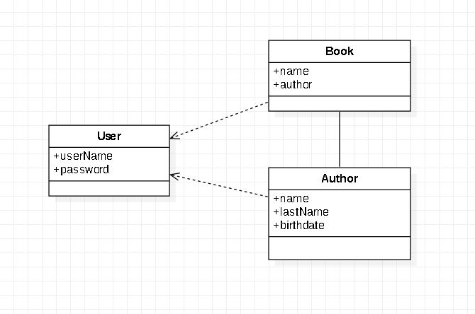
</p>

### Use Case Diagram

<p align="center">
  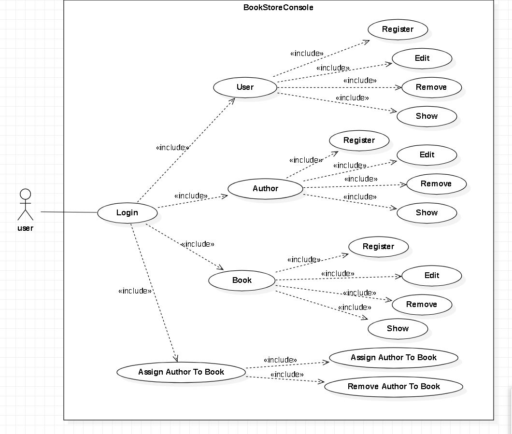
</p>

## UI

### Login

<p align="center">
  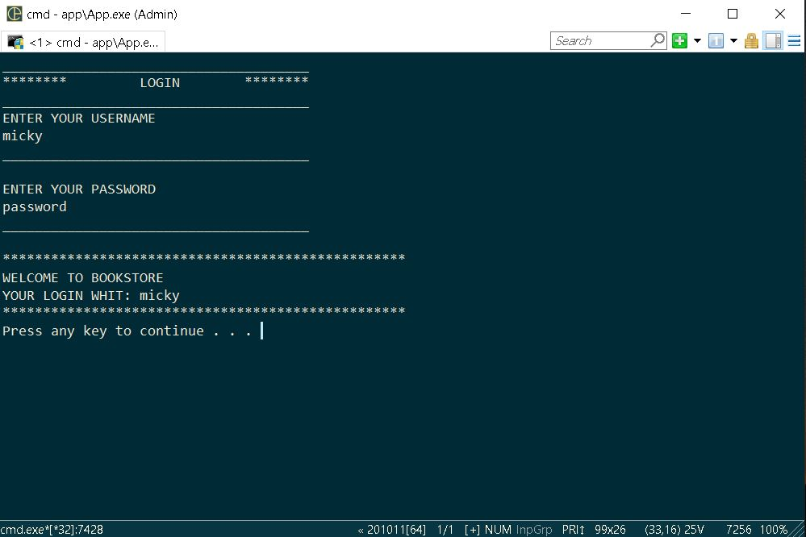
</p>

### Main menu

<p align="center">
  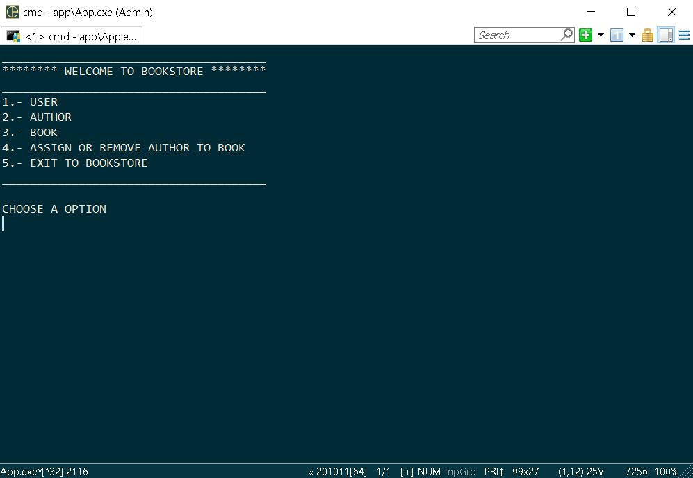
</p>

### User Menu

<p align="center">
  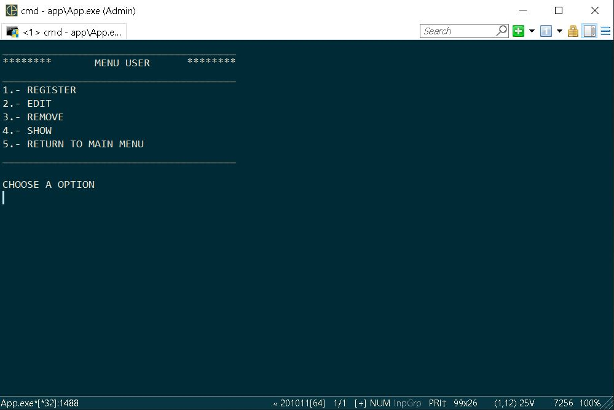
</p>

### Show Users

<p align="center">
  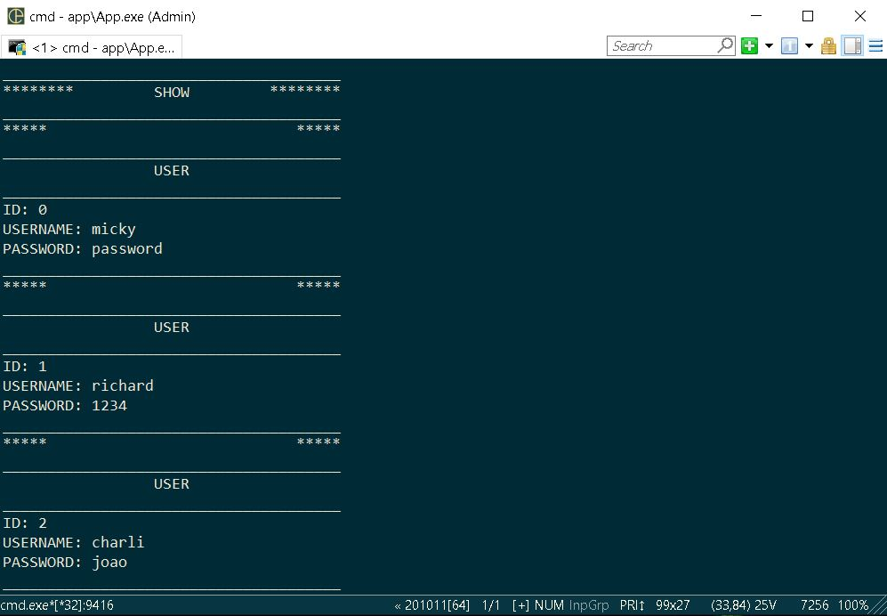
</p>

### Author Menu

<p align="center">
  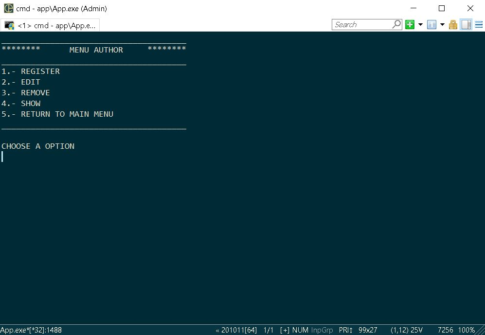
</p>

### Show Authors

<p align="center">
  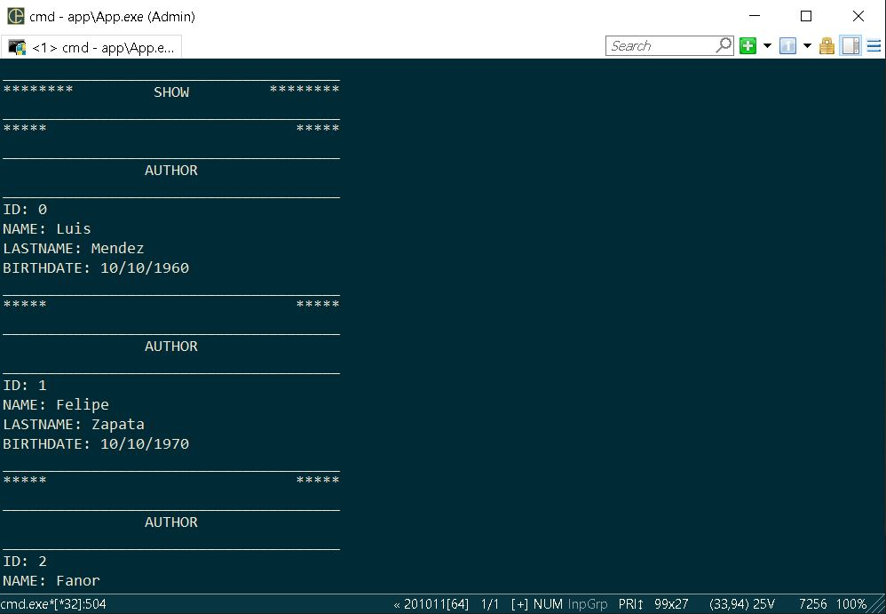
</p>

### Book Menu

<p align="center">
  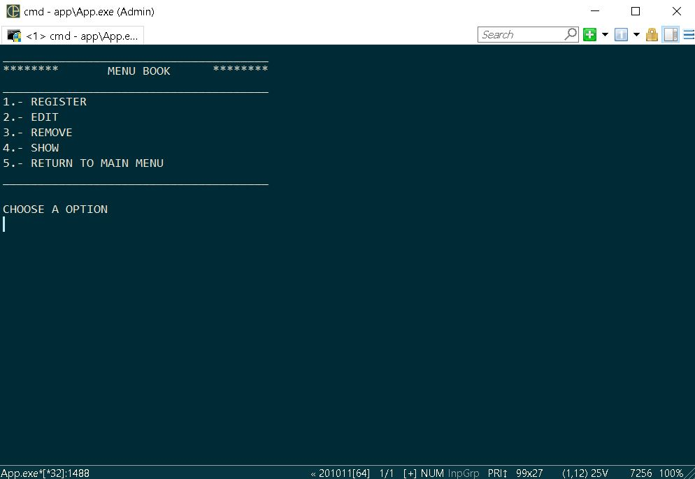
</p>

### Show Books

<p align="center">
  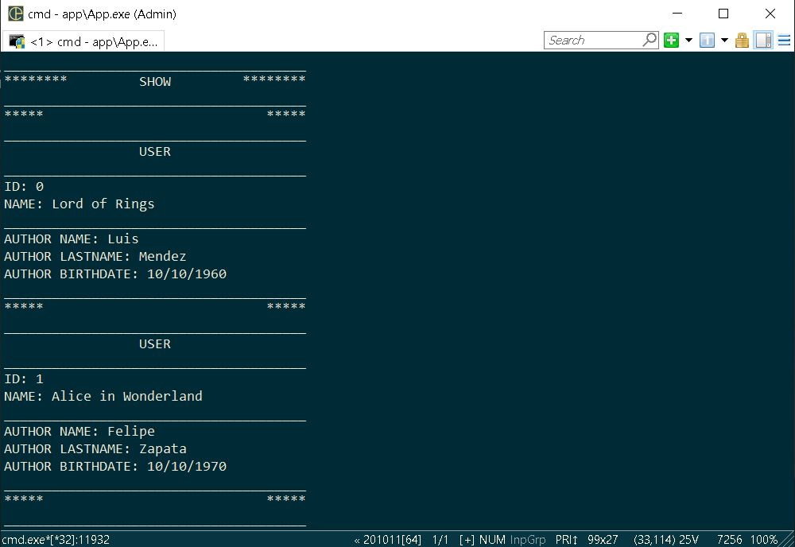
</p>

### Assign Or Remove Account Menu

<p align="center">
  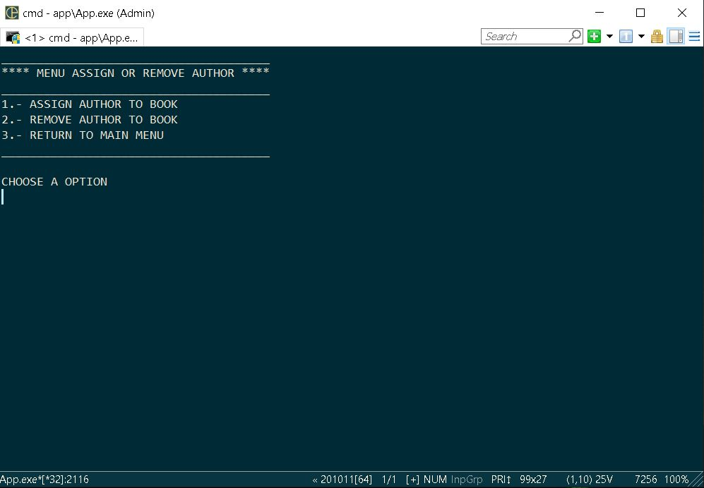
</p>

### GoodBye

<p align="center">
  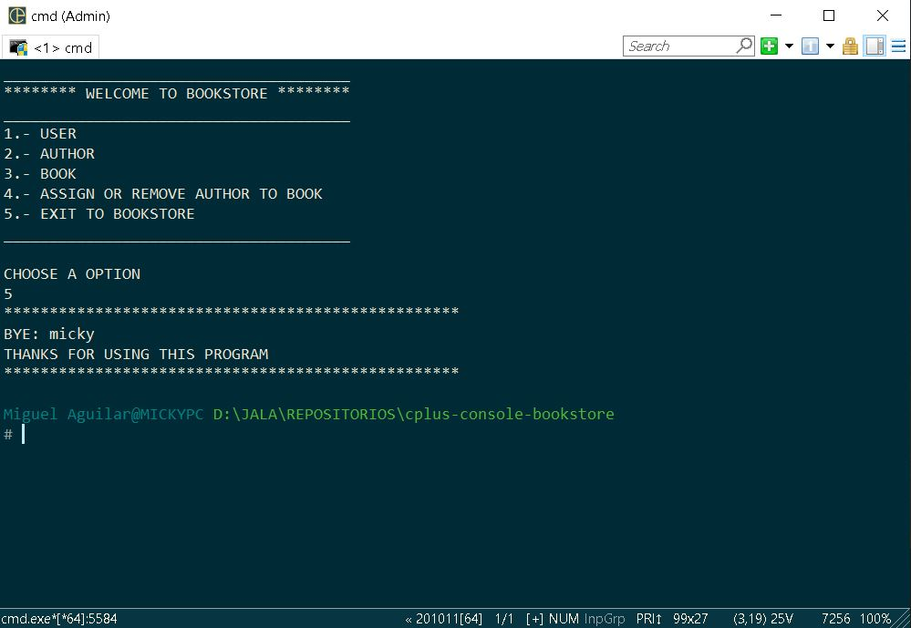
</p>
